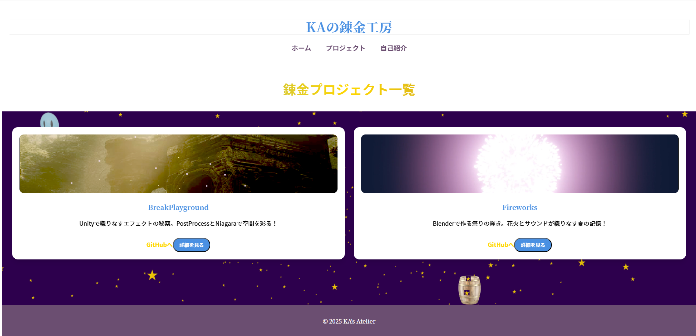

# Alchemist Sparkle ～KAの錬金工房～

🌟 **ようこそ！**  
**Alchemist Sparkle** は、魔法と錬金術の世界にインスパイアされた、幻想的なウェブプロジェクトです。このリポジトリには、アトリエ風のクリエイティブなデザインとインタラクティブな要素がたっぷり詰め込まれています。

---

## 🧪 概要

KAの錬金工房は、「アトリエシリーズ」に触発されたウェブサイトで、錬金術のテーマと温かみのあるデザインを組み合わせています。  
以下の技術や要素を使用し、ユーザー体験を深く彩っています：


## 🌟 プレビュー
以下はプロジェクトの画面サンプルです：





- **使用技術**: Vue.js、Three.js、GSAP、Tailwind CSS  
- **デザインテーマ**: 錬金釜、星々のスパークル、錬金プロジェクトのリストと世界観の共有  

---

## 🌌 プロジェクトの目的

**Alchemist Sparkle**は、以下を目指して設計されたウェブプロジェクトです：
- 錬金術のテーマを通じて創造性を刺激する
- Vue.jsやThree.jsを用いた魅力的なインタラクティブ体験を提供
- 魅力的で洗練されたウェブデザインのインスピレーションを共有

---

## 🛠️ プロジェクトの内容

このプロジェクトには以下の主要なコンポーネントが含まれています：

### 🎨 デザイン & アニメーション
- **背景効果**: 流れる星々の演出 (Three.js + GSAP)  
- **ページ遷移アニメーション**: スムーズな視覚効果  
- **モジュール化されたコンポーネント構成**

### 🔮 主なページ
1. **ホームページ**: 錬金の工房を紹介  
2. **プロジェクト一覧**: KAのこれまでの創作プロジェクトを展示  
3. **自己紹介ページ**: 錬金術師KAのストーリーとスキルを紹介  

---

## 🚀 使用方法

### リポジトリのクローン
まず、リポジトリをクローンしてください：
```bash
git clone https://github.com/kiji44hn/alchemist-sparkle.git
```

## 必要な依存関係をインストール
プロジェクトディレクトリに移動し、依存関係をインストールします：

```bash
cd alchemist-sparkle
npm install
```

## ローカルサーバーの起動
以下のコマンドで開発サーバーを起動し、アトリエの魔法を体験してください：

```bash
npm run dev
```

## プロダクションビルド
本番環境用に最適化されたファイルをビルドします：

```bash
npm run build
```

## 📁 ディレクトリ構造

```
alchemist-sparkle/
├── public/               # 静的ファイル
├── src/                  # ソースコード
│   ├── assets/           # 画像やアイコン
│   ├── components/       # Vueコンポーネント
│   ├── views/            # 各ページのテンプレート
│   ├── styles/           # Tailwind CSSとカスタムスタイル
├── package.json          # プロジェクト設定と依存関係
└── vite.config.ts        # Vite設定
```

## ✨ 特徴的なコンポーネント

```
- BubblePot.vue: 錬金釜をテーマにした遊び心あるコンポーネント
- AlchemistScene.vue: 星空のインタラクティブな背景描画
- AudioPlayer.vue: 癒しのBGM再生機能
```

## 🖋️ 著者情報

```
- 名前: KA
- テーマ: 錬金術とクリエイティブなデザインの融合
- 連絡先: [kiji44hn](連絡先: GitHub)
```

## 🤝 コントリビューション

```
1. リポジトリをフォーク
2. 新しいブランチを作成
3. 修正内容をプッシュ
4. プルリクエストを作成
```

### 🌟 Alchemist Sparkle に触れ、この工房の魔法に魅了されてみてください！